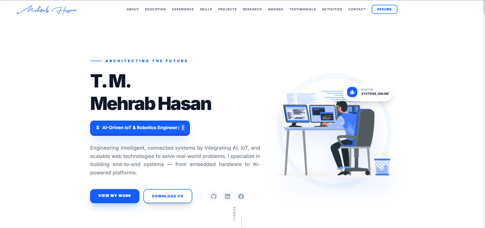

# T. M. Mehrab Hasan | Portfolio

An AI-driven IoT & Robotics Engineer and Full-Stack Developer portfolio built with modern web technologies.

[](https://tm-mehrab-hasan.vercel.app/)

The Portfolio Website is live at - https://tm-mehrab-hasan.vercel.app/

## 🚀 Overview

Engineering intelligent, connected systems by integrating AI, IoT, and scalable web technologies to solve real-world problems. This portfolio showcases my journey, projects, and expertise in building end-to-end systems — from embedded hardware to AI-powered platforms.

## 🛠️ Tech Stack

- **Framework:** [Next.js](https://nextjs.org/) (App Router)
- **Library:** [React 19](https://react.dev/)
- **Styling:** [Tailwind CSS 4](https://tailwindcss.com/)
- **Animations:** [Framer Motion](https://www.framer.com/motion/) & [Lenis](https://lenis.darkroom.engineering/) (Smooth Scroll)
- **Language:** [TypeScript](https://www.typescriptlang.org/)
- **Icons:** [Iconify](https://iconify.design/)
- **Components:** [LottieFiles](https://lottiefiles.com/)

## ✨ Key Features

- **Responsive Design:** Fully optimized for mobile, tablet, and desktop.
- **Dynamic Content:** All portfolio data is centralized in `src/lib/content` for easy updates.
- **Smooth Animations:** Integrated Framer Motion and Lenis for a polished user experience.
- **SEO Optimized:** Built-in SEO management with `seo.ts`.
- **Comprehensive Sections:**
  - **Hero:** Impactful introduction with typewriter effect.
  - **Experience:** Interactive timeline of professional growth.
  - **Projects:** Featured and regular project showcases with modals.
  - **Skills:** Categorized skill grid.
  - **Education & Publications:** Detailed academic and research history.
  - **Contact:** Integrated contact form (EmailJS ready).

## 🏃 Getting Started

### Prerequisites

- [Node.js](https://nodejs.org/) (v18+ recommended)
- [npm](https://www.npmjs.com/) or [yarn](https://yarnpkg.com/)

### Installation

1. Clone the repository:
   ```bash
   git clone https://github.com/TM-Mehrab-Hasan/Vercel-Portfolio.git
   ```
2. Navigate to the project directory:
   ```bash
   cd mehrab-portfolio-v2
   ```
3. Install dependencies:
   ```bash
   npm install
   ```

### Development

Run the development server:
```bash
npm run dev
```
Open [http://localhost:3000](http://localhost:3000) with your browser to see the result.

### Build

To create an optimized production build (Static Export):
```bash
npm run build
```
The static files will be generated in the `out/` directory.

## 📂 Project Structure

```text
src/
├── app/          # App router pages and layouts
├── components/   # Reusable UI components
├── containers/   # Major page sections
├── lib/
│   ├── content/  # Centralized portfolio data (Edit here!)
│   ├── types/    # TypeScript interfaces
│   └── utils/    # Utility functions and animations
```

## 📄 License

This project is licensed under the MIT License.

## 🤝 Contact

**T. M. Mehrab Hasan**  
Currently focused on BITSS VWAR as a Jr. Software Developer.

[LinkedIn](https://www.linkedin.com/in/tm-mehrab-hasan/) | [GitHub](https://github.com/TM-Mehrab-Hasan)
